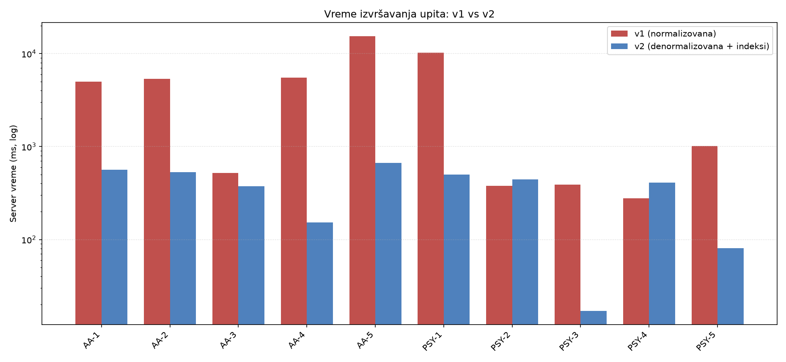
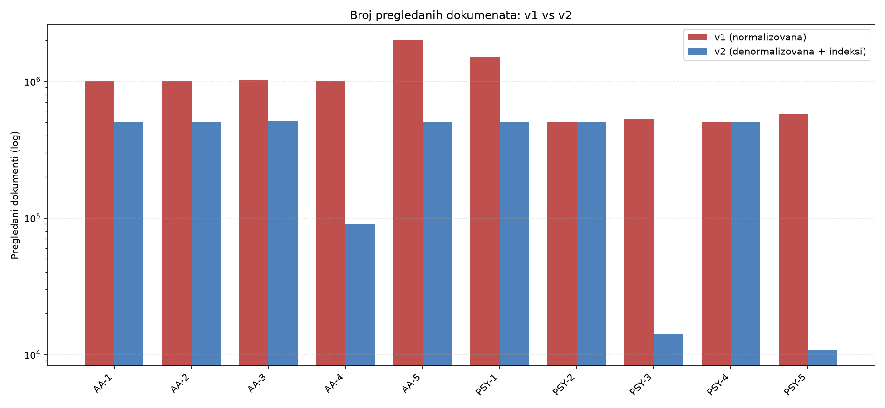
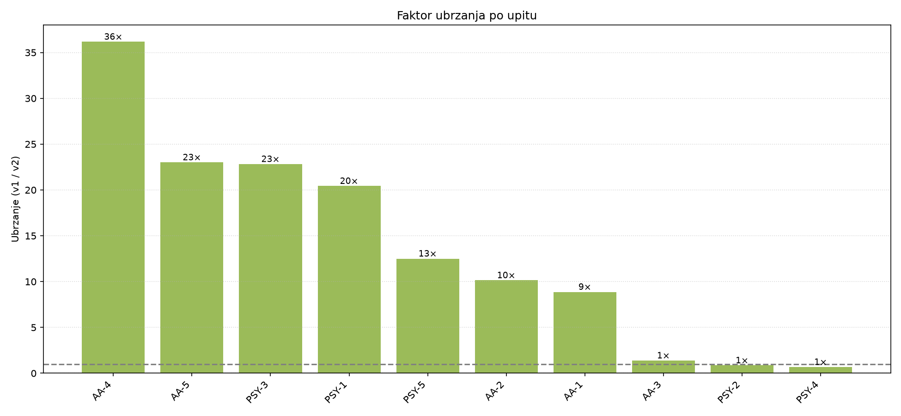

# Analiza digitalnog ponašanja studenata — izveštaj

**Predmet:** Sistemi baza podataka · **Baza:** MongoDB 7 · **Jezik:** Python (pymongo)

---

## 1. Uvod i tema

Cilj projekta je analiza digitalnog ponašanja studenata (korišćenje društvenih mreža,
tip konzumiranog sadržaja, mentalno zdravlje, akademski rizik) nad skupom od
**500.000 studenata**. Projekat prolazi kroz pun ciklus: priprema podataka →
analitički upiti → analiza performansi i uočavanje uskih grla → optimizacija
(restrukturiranje šeme + indeksiranje) → prerada upita → uporedna analiza i
vizualizacija.

Centralna ideja optimizacije: **iz normalizovane šeme (v1) sa više kolekcija, koja
upite tera na `$lookup` spajanja, prelazimo na denormalizovanu šemu (v2)** sa jednom
kolekcijom, prekomputovanim poljima i indeksima.

## 2. Skup podataka

CSV `global_student_digital_behavior_dataset.csv`: 500.000 redova, 48 kolona, ~50 zemalja.
Kolone obuhvataju: demografiju (uzrast, pol, urbano/ruralno, prihod, obrazovanje),
državni kontekst (razvijenost, infrastruktura), ponašanje na mrežama (sati, sesije,
tip sadržaja, kasno-noćno korišćenje), mentalno zdravlje (san, stres, anksioznost,
depresija, wellbeing), akademske pokazatelje (motivacija, učenje, prisustvo,
produktivnost, akademski rizik) i izvedene skorove (brain rot, digitalna zavisnost).

**Karakteristike podataka (utvrđene merenjem) bitne za upite:**
- `academic_risk_score`: 96,6% je 0, samo 3,37% (16.866) > 0 (prosek 0,11) — "iznad
  proseka" je netrivijalan podskup.
- Pragovi u upitima su **percentilni**: `digital_addiction_score > 18.04` ≈ p75,
  `wellbeing_index < 50.06` ≈ p25, `social_media_hours ≤ 4.20` ≈ p75.
- `brain_rot_index`: prosek 19, p25=12,57 / p75=25,09 / p95=34,77 (osnova za nivoe sagorevanja).
- `brain_rot_level` ima samo Low/Moderate + 6.262 praznih (zato sagorevanje izvodimo iz
  `brain_rot_index`).

**Čišćenje pri unosu:** `cyberbullying_exposure`/`adult_content_exposure` → bool;
prazne vrednosti → `null` (bez prinudnog svrstavanja u kategoriju); eksplicitna
tipizacija (bez inferencije), čime se izbegava `NaN` u Mongo-u.

## 3. v1 — inicijalna normalizovana šema

Podela na **6 kolekcija** povezanih preko `student_id`: `countries` (dimenzija ~50),
`students`, `digital_behavior`, `academic`, `wellbeing`, `economic`.
`students.country` je FK ka `countries._id`; child kolekcije imaju `_id = student_id`.
Detalji i primeri dokumenata: [`v1/schema/README.md`](../v1/schema/README.md).

**Bez sekundarnih indeksa** — v1 je namerno "netjunovan" baseline: svaki `$match` po
ne-`_id` polju je COLLSCAN, a join-ovi su na `_id`. Time je izmereno usko grlo realno
(dolazi od spajanja i skeniranja, ne od loše veze).

## 4. Unos podataka

`v1/scripts/load_v1.py`: streaming `csv.DictReader` (konstantna memorija nad 319 MB),
eksplicitna tipizacija, podela reda u 5 child kolekcija + dedupe `countries` dimenzije,
batch `bulk_write([InsertOne...], ordered=False)` po 5.000. Idempotentno (briše bazu
pre unosa).

## 5. v2 — optimizovana denormalizovana šema

Jedna kolekcija `students` sa svim poljima inline, poddokumentom `derived` i indeksima.
Detalji: [`v2/schema/README.md`](../v2/schema/README.md).

**Primenjeni MongoDB design paterni** (uz obrazloženje neprimenljivih):

| Pattern | Primena / razlog |
|---|---|
| **Computed** | `derived` poddokument — sve izvedene vrednosti (age_group, dominant_content_type, social_media_band, digital_burnout_level, session_exceeds_attention, is_late_night, addiction_high_risk, has_academic_risk) računaju se **jednom pri unosu** umesto u svakom upitu. Srž optimizacije. |
| **Extended Reference** | `development_level` denormalizovan iz `countries` u svaki dokument → AA-5 više ne mora da spaja dimenziju. |
| **Schema Versioning** | dve generacije šeme (`sbp-v1` → `sbp-v2`) + polje `schema_version`; direktno odgovara zahtevu "restrukturiranje šeme". |
| **Subset** | ekonomska polja i nekorišćene infrastrukturne kolone se izostavljaju iz vruće kolekcije → manji radni skup, bolja iskorišćenost keša. |
| **Attribute** *(opciono)* | 4 `*_content_hours` mogu se modelovati kao niz `content:[{type,hours}]` sa multikey indeksom (alternativa Computed `dominant_content_type`). |
| **Approximation** *(lagano)* | percentilni pragovi i totali kao prekomputovane konstante. |
| **Bucket** *(konceptualno)* | nema vremenske serije po studentu (za razliku od klasičnog primera sa Twitch opservacijama) — baketiranje je analitičko (Computed polja) + materijalizovane `results_*` kolekcije. |
| **Polymorphic** | N/A — studentski dokumenti su homogeni. |
| **Tree** | N/A — nema rekurzivne hijerarhije (country→student je jednostruka referenca). |
| **Document Versioning** | N/A — statički snimak, dokumenti se ne menjaju kroz vreme. |
| **Outlier** | N/A (skladišno) — ujednačena veličina dokumenata; postoje samo *podatkovni* outlieri (npr. visok rizik kod manjine). |

**Indeksiranje:** po jedan indeks po upitu prema njegovim `$match`/`$group`/`$sort`
ključevima (npr. `{derived.age_group:1}`, složeni `{digital_addiction_score:1,
wellbeing_index:1, social_media_hours:1}`, `{development_level:1, family_income_level:1}`).
Vidi `v2/scripts/indexes.py`.

## 6. Upiti (10)

5 za ulogu **studentski psiholog** (PSY-1..5) + 5 za **akademski savetnik** (AA-1..5),
pisani kao **klasičan mongosh** (pokreću se u `mongosh`/Compass). Pune implementacije
(v1 sa `$lookup`, v2 bez) i izmerena vremena: [`v1/queries/`](../v1/queries) i
[`v2/queries/`](../v2/queries).

Napomena o iskrenosti analize: PSY-2 i PSY-4 su jednokolekcijski i u v1 (nemaju join),
pa im je dobitak u v2 mali (samo Computed/indeks); najveće ubrzanje očekujemo kod
join-teških **AA-5** (4 kolekcije), **PSY-1/PSY-3** (3) i **AA-4**.

## 7. Metodologija merenja performansi

Za svaki upit × {v1, v2} mereno je preko `explain("executionStats")` u `mongosh`-u:
- **server vreme** (`executionTimeMillis`) i **broj pregledanih dokumenata/ključeva**
  (`totalDocsExamined`/`totalKeysExamined`, sabrano kroz sve faze — `$lookup` ima
  ugnježdene pod-explain-e);
- uzeta je **medijana od 3 izvršavanja** (uz prethodni „warm-up", radi smanjenja šuma);
- `allowDiskUse: true` na svim upitima (veliki `$group`/`$lookup` prelaze 100 MB).

Izmerene vrednosti su zabeležene u `benchmarks/results.csv`. U v1 je `keys_examined = 0`
(COLLSCAN), a u v2 filtrirajući upiti koriste IXSCAN (`keys_examined > 0`) uz znatno manji
`docs_examined`.

## 8. Rezultati performansi (uporedna analiza)

Izmereno (server vreme iz `executionStats`, medijana od 3; `docs` = pregledani dokumenti):

| Upit | Kolekcije v1 (join) | v1 [ms] | v2 [ms] | Ubrzanje | v1 docs | v2 docs |
|---|---|---:|---:|---:|---:|---:|
| AA-5 | countries+students+academic+wellbeing (3) | 15394 | 669 | **23,0×** | 2.000.003 | 500.000 |
| PSY-1 | students+wellbeing+academic (2) | 10256 | 502 | **20,4×** | 1.500.002 | 500.000 |
| AA-4 | digital_behavior+academic (1) | 5534 | 153 | **36,2×** | 1.000.001 | 90.432 |
| AA-2 | wellbeing+students (1) | 5365 | 529 | **10,1×** | 1.000.001 | 500.000 |
| AA-1 | digital_behavior+academic (1) | 5015 | 565 | **8,9×** | 1.000.001 | 500.000 |
| PSY-5 | wellbeing+digital_behavior (1) | 1013 | 81 | **12,5×** | 573.650 | 10.690 |
| AA-3 | academic+digital_behavior (1), 2 koraka | 522 | 376 | 1,4× | 1.016.392 | 516.391 |
| PSY-3 | digital_behavior+wellbeing+academic (2) | 388 | 17 | **22,8×** | 528.208 | 14.103 |
| PSY-2 | digital_behavior (0) | 379 | 442 | 0,86× | 500.000 | 500.000 |
| PSY-4 | wellbeing (0) | 278 | 410 | 0,68× | 500.000 | 500.000 |

Cifre su zabeležene u `benchmarks/results.csv`; grafici se generišu iz njega (`charts/make_charts.py`).

**Analiza:** ubrzanje u v2 dolazi od tri izvora: (1) **eliminacije `$lookup` join-ova**
(najizraženije kod AA-5), (2) **prekomputovanih `derived` polja** (nema argmax/baketiranja
po dokumentu pri svakom upitu), i (3) **indeksa** koji filtrirajuće upite prebacuju sa
COLLSCAN na IXSCAN (PSY-3: 528k→14k dokumenata, PSY-5: 574k→11k). Najveći efekti:
**AA-4 36×**, **AA-5 23×** (4 kolekcije → jedna), **PSY-1 20×**, **PSY-3 23×**.

Tamo gde nema ni join-a ni selektivnog filtera, denormalizacija ne pomaže — štaviše,
PSY-2 (0,86×) i PSY-4 (0,68×) su u v2 **neznatno sporiji** jer su dokumenti širi (više
polja po dokumentu za skeniranje pri punom `$group`-u). AA-3 je rešen u **dva koraka**
(prosek pa filter): indeks u v2 ubrzava korak filtriranja (28 ms naspram 295 ms u v1),
ali neizbežan pun prolaz radi računanja proseka dominira, pa je ukupno ubrzanje skromno
(~1,4×). Ovo svesno uključujemo u analizu: denormalizacija i indeksi su ciljana
optimizacija za join-teške i filtrirajuće upite, a ne univerzalni dobitak.

## 9. Vizualizacija u Metabase-u

Rezultati upita materijalizovani su u `results_*` kolekcije
(`metabase/write_results.js`, pokreće se kroz `mongosh`) i prikazani na dashboard-u.
Uputstvo i predlog kartica: [`metabase/SETUP.md`](../metabase/SETUP.md).

## 10. Zaključak

Normalizovana šema je prirodna i čista, ali nameće cenu spajanja pri analitici nad
500k dokumenata. Denormalizacija uz Computed polja i ciljano indeksiranje dramatično
ubrzava join-teške upite, uz svesnu razmenu (veći dokumenti, redundansa, potreba za
održavanjem izvedenih vrednosti). Izbor paterna je vođen stvarnim potrebama upita, a ne
mehaničkom primenom svih — neprimenljivi paterni su obrazloženi.
