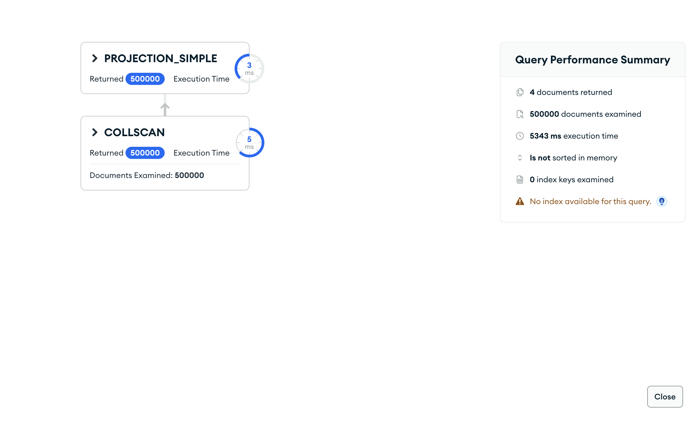
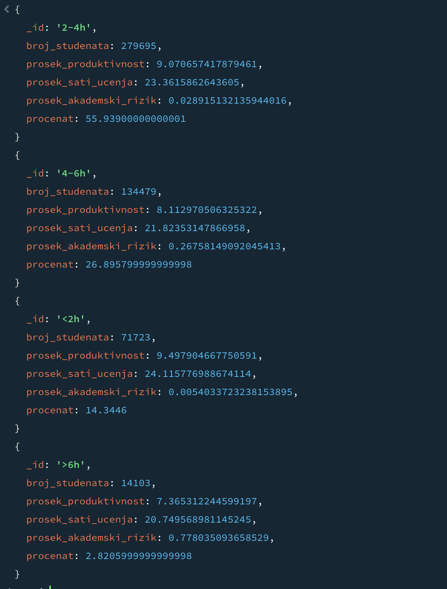

# Upit 1 - Grupisati studente po dnevnim satima korišćenja društvenih mreža (<2h, 2-4h, 4-6h, >6h); prikazati broj studenata, procenat, prosečan skor produktivnosti, prosečan broj sati učenja i prosečan akademski rizik.

Kod upita:

~~~
// ukupan broj studenata
const ukupno = db.digital_behavior.countDocuments();

db.digital_behavior.aggregate([
  { $lookup: { from: "academic", localField: "_id", foreignField: "_id", as: "a" } },
  { $unwind: "$a" },
  { $addFields: { band: { $switch: { branches: [
        { case: { $lt: ["$social_media_hours", 2] }, then: "<2h" },
        { case: { $lt: ["$social_media_hours", 4] }, then: "2-4h" },
        { case: { $lte: ["$social_media_hours", 6] }, then: "4-6h" }
      ], default: ">6h" } } } },
  { $group: {
      _id: "$band",
      broj_studenata: { $sum: 1 },
      prosek_produktivnost: { $avg: "$a.productivity_score" },
      prosek_sati_ucenja: { $avg: "$a.study_hours_per_week" },
      prosek_akademski_rizik: { $avg: "$a.academic_risk_score" } } },
  { $addFields: { procenat: { $multiply: [{ $divide: ["$broj_studenata", ukupno] }, 100] } } },
  { $sort: { _id: 1 } }
], { allowDiskUse: true })
~~~

Brzina izvršavanja: 5015 ms

Rezultat Explain opcije:

Primer izlaznog dokumenta:

