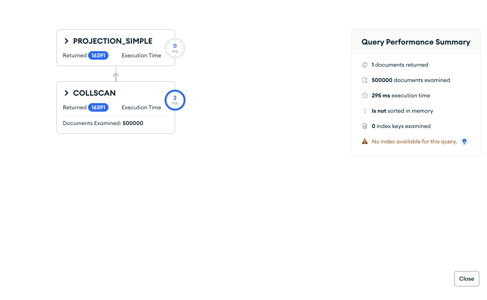
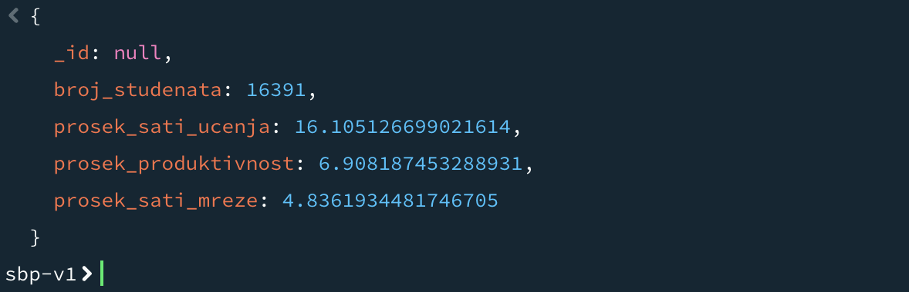

# Upit 3 - Izdvojiti studente sa akademskim rizikom iznad proseka; prikazati ukupan broj studenata, prosečan broj sati učenja, prosečan skor produktivnosti i prosečan broj sati na društvenim mrežama.

Kod upita:

~~~
// 1) prosečan akademski rizik
const prosek = db.academic.aggregate([
  { $group: { _id: null, m: { $avg: "$academic_risk_score" } } }
]).toArray()[0].m;

// 2) studenti iznad proseka
db.academic.aggregate([
  { $match: { academic_risk_score: { $gt: prosek } } },
  { $lookup: { from: "digital_behavior", localField: "_id", foreignField: "_id", as: "d" } },
  { $unwind: "$d" },
  { $group: {
      _id: null,
      broj_studenata: { $sum: 1 },
      prosek_sati_ucenja: { $avg: "$study_hours_per_week" },
      prosek_produktivnost: { $avg: "$productivity_score" },
      prosek_sati_mreze: { $avg: "$d.social_media_hours" } } }
], { allowDiskUse: true })
~~~

Brzina izvršavanja: 522 ms

Rezultat Explain opcije:

Primer izlaznog dokumenta:

