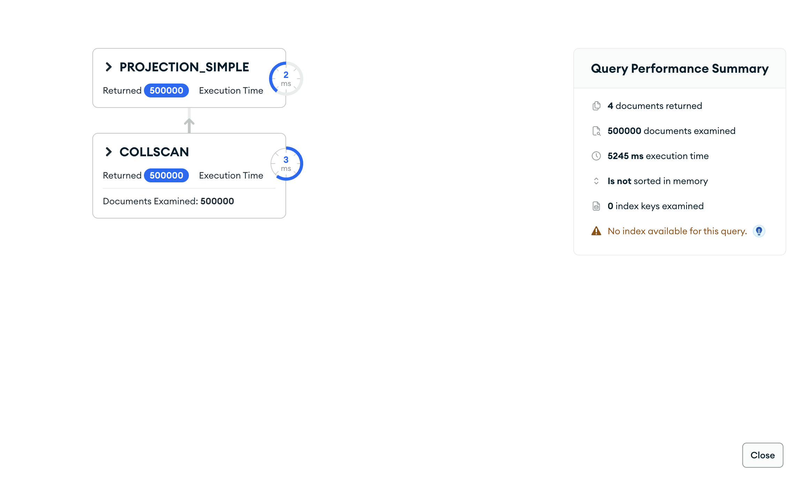
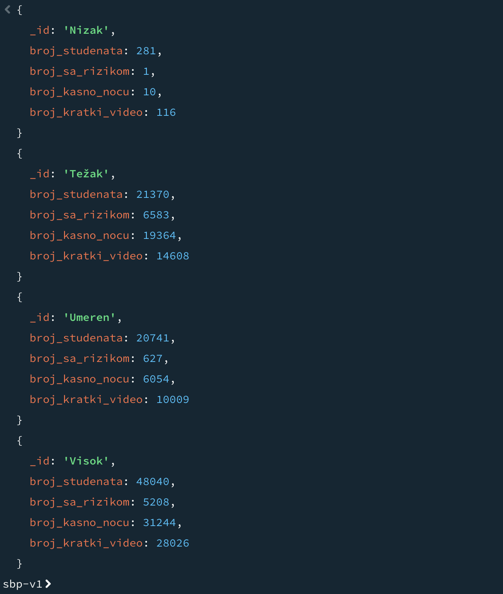

# Upit 4 - Studenti kod kojih je prosečno trajanje sesije duže od trajanja koncentracije, grupisani po nivou digitalnog sagorevanja (iz brain_rot_index); za svaku grupu broj studenata, broj sa akademskim rizikom ≠ 0, broj koji koriste mreže kasno noću i broj sa dominantnim kratkim videom.

Kod upita:

~~~
db.digital_behavior.aggregate([
  { $lookup: { from: "academic", localField: "_id", foreignField: "_id", as: "a" } },
  { $unwind: "$a" },
  { $match: { $expr: { $gt: ["$average_session_length_minutes", "$a.attention_span_minutes"] } } },
  { $addFields: {
      burnout: { $switch: { branches: [
        { case: { $lt: ["$brain_rot_index", 12.57] }, then: "Nizak" },
        { case: { $lt: ["$brain_rot_index", 25.09] }, then: "Umeren" },
        { case: { $lt: ["$brain_rot_index", 34.77] }, then: "Visok" }
      ], default: "Težak" } },
      dominant: { $let: {
        vars: { m: { $max: ["$education_content_hours", "$short_video_hours",
                            "$entertainment_content_hours", "$news_content_hours"] } },
        in: { $switch: { branches: [
          { case: { $eq: ["$education_content_hours", "$$m"] }, then: "educational" },
          { case: { $eq: ["$short_video_hours", "$$m"] }, then: "short_video" },
          { case: { $eq: ["$entertainment_content_hours", "$$m"] }, then: "entertainment" }
        ], default: "informative" } } } },
      is_late: { $in: ["$late_night_usage", ["Often", "Always"]] } } },
  { $group: {
      _id: "$burnout",
      broj_studenata: { $sum: 1 },
      broj_sa_rizikom: { $sum: { $cond: [{ $ne: ["$a.academic_risk_score", 0] }, 1, 0] } },
      broj_kasno_nocu: { $sum: { $cond: ["$is_late", 1, 0] } },
      broj_kratki_video: { $sum: { $cond: [{ $eq: ["$dominant", "short_video"] }, 1, 0] } } } },
  { $sort: { _id: 1 } }
], { allowDiskUse: true })
~~~

Brzina izvršavanja: 5534 ms

Rezultat Explain opcije:

Primer izlaznog dokumenta:

