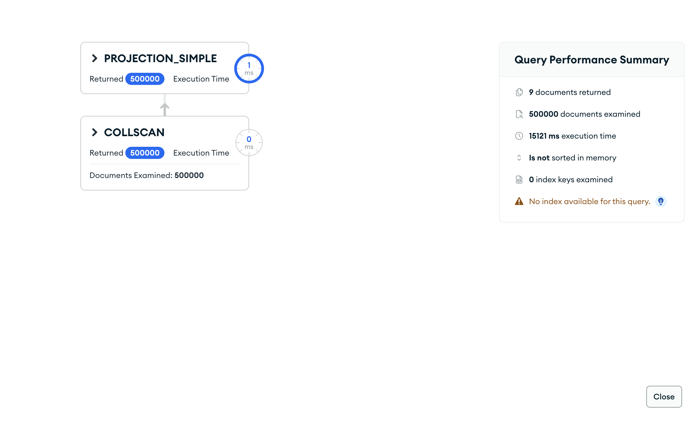
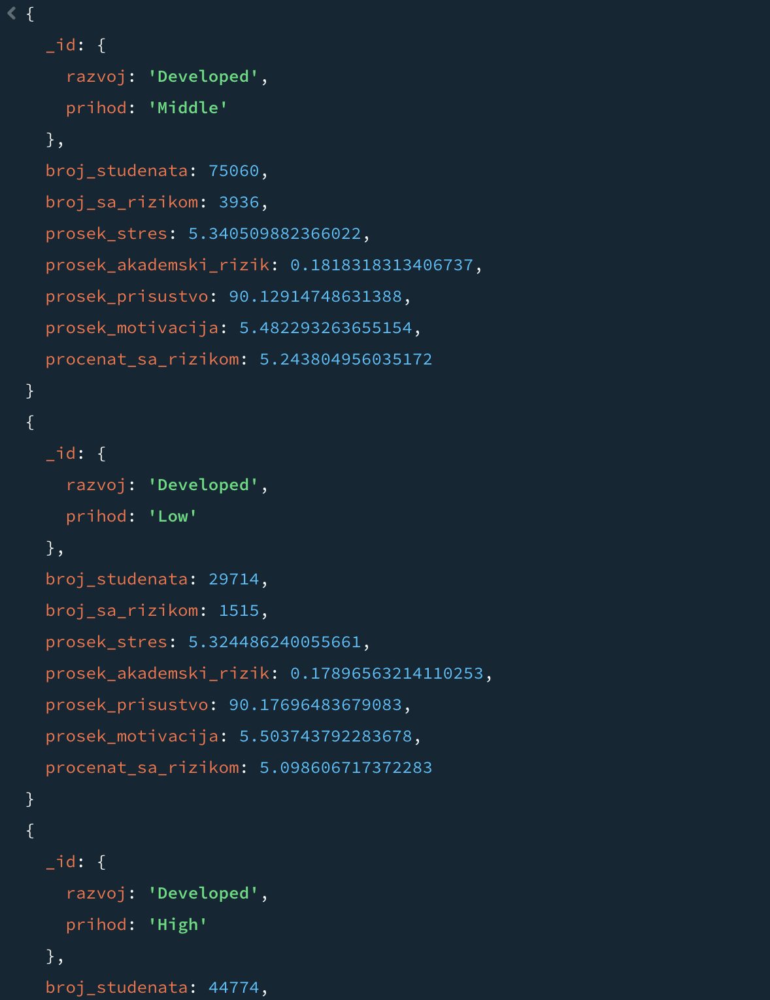

# Upit 5 - Grupisati studente prema kombinaciji nivoa razvijenosti države i nivoa prihoda porodice; za svaku grupu broj studenata, procenat sa akademskim rizikom (>0), prosečan stres, prosečan akademski rizik, prosečno prisustvo nastavi i prosečnu akademsku motivaciju, sortirano opadajuće po procentu sa rizikom.

Kod upita:

~~~
db.students.aggregate([
  { $lookup: { from: "countries", localField: "country", foreignField: "_id", as: "c" } },
  { $unwind: "$c" },
  { $lookup: { from: "academic", localField: "_id", foreignField: "_id", as: "a" } },
  { $unwind: "$a" },
  { $lookup: { from: "wellbeing", localField: "_id", foreignField: "_id", as: "w" } },
  { $unwind: "$w" },
  { $group: {
      _id: { razvoj: "$c.development_level", prihod: "$family_income_level" },
      broj_studenata: { $sum: 1 },
      broj_sa_rizikom: { $sum: { $cond: [{ $gt: ["$a.academic_risk_score", 0] }, 1, 0] } },
      prosek_stres: { $avg: "$w.stress_level" },
      prosek_akademski_rizik: { $avg: "$a.academic_risk_score" },
      prosek_prisustvo: { $avg: "$a.class_attendance_rate" },
      prosek_motivacija: { $avg: "$a.academic_motivation" } } },
  { $addFields: { procenat_sa_rizikom: {
      $multiply: [{ $divide: ["$broj_sa_rizikom", "$broj_studenata"] }, 100] } } },
  { $sort: { procenat_sa_rizikom: -1 } }
], { allowDiskUse: true })
~~~

Brzina izvršavanja: 15394 ms

Rezultat Explain opcije:

Primer izlaznog dokumenta:

