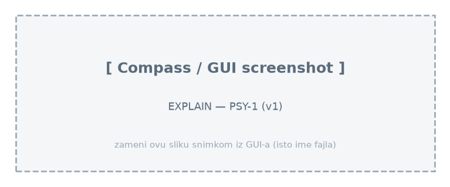
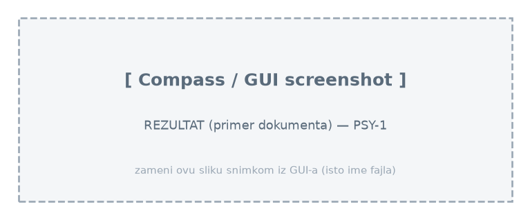

# Upit 1 - Grupisati studente po starosnim grupama (15-17, 18-20, 21-23, 24-25) i prikazati prosečnu depresivnost, anksioznost, stres i akademski rizik.

Kod upita:

~~~
db.students.aggregate([
  { $lookup: { from: "wellbeing", localField: "_id", foreignField: "_id", as: "w" } },
  { $unwind: "$w" },
  { $lookup: { from: "academic", localField: "_id", foreignField: "_id", as: "a" } },
  { $unwind: "$a" },
  { $addFields: { age_group: { $switch: { branches: [
        { case: { $lte: ["$age", 17] }, then: "15-17" },
        { case: { $lte: ["$age", 20] }, then: "18-20" },
        { case: { $lte: ["$age", 23] }, then: "21-23" }
      ], default: "24-25" } } } },
  { $group: {
      _id: "$age_group",
      broj_studenata: { $sum: 1 },
      prosek_depresija: { $avg: "$w.depression_score" },
      prosek_anksioznost: { $avg: "$w.anxiety_score" },
      prosek_stres: { $avg: "$w.stress_level" },
      prosek_akademski_rizik: { $avg: "$a.academic_risk_score" } } },
  { $sort: { _id: 1 } }
], { allowDiskUse: true })
~~~

Brzina izvršavanja: 10256 ms

Rezultat Explain opcije:

Primer izlaznog dokumenta:

