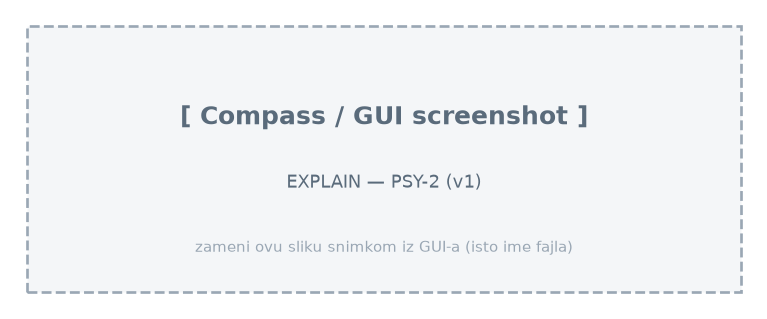
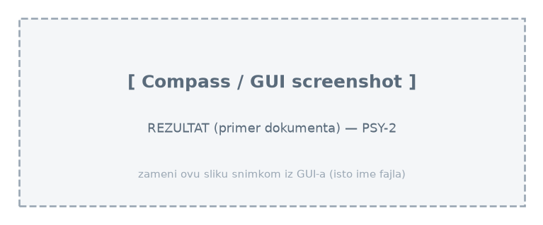

# Upit 2 - Grupisati studente prema dominantnom tipu digitalnog sadržaja; prikazati broj studenata i prosečan brain rot indeks, sortirano opadajuće po brain rot indeksu.

Kod upita:

~~~
db.digital_behavior.aggregate([
  { $addFields: { dominant_content_type: { $let: {
      vars: { m: { $max: ["$education_content_hours", "$short_video_hours",
                          "$entertainment_content_hours", "$news_content_hours"] } },
      in: { $switch: { branches: [
        { case: { $eq: ["$education_content_hours", "$$m"] }, then: "educational" },
        { case: { $eq: ["$short_video_hours", "$$m"] }, then: "short_video" },
        { case: { $eq: ["$entertainment_content_hours", "$$m"] }, then: "entertainment" }
      ], default: "informative" } } } } } },
  { $group: {
      _id: "$dominant_content_type",
      broj_studenata: { $sum: 1 },
      prosek_brain_rot: { $avg: "$brain_rot_index" } } },
  { $sort: { prosek_brain_rot: -1 } }
], { allowDiskUse: true })
~~~

Brzina izvršavanja: 379 ms

Rezultat Explain opcije:

Primer izlaznog dokumenta:

