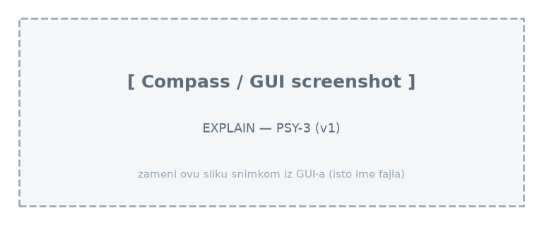
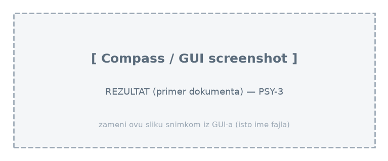

# Upit 3 - Prikazati broj studenata koji koriste društvene mreže više od 6 sati dnevno, i za tu grupu prosečan broj sati sna, prosečan raspon pažnje i prosečan skor produktivnosti.

Kod upita:

~~~
db.digital_behavior.aggregate([
  { $match: { social_media_hours: { $gt: 6 } } },
  { $lookup: { from: "wellbeing", localField: "_id", foreignField: "_id", as: "w" } },
  { $unwind: "$w" },
  { $lookup: { from: "academic", localField: "_id", foreignField: "_id", as: "a" } },
  { $unwind: "$a" },
  { $group: {
      _id: null,
      broj_studenata: { $sum: 1 },
      prosek_san: { $avg: "$w.sleep_hours" },
      prosek_paznja: { $avg: "$a.attention_span_minutes" },
      prosek_produktivnost: { $avg: "$a.productivity_score" } } }
], { allowDiskUse: true })
~~~

Brzina izvršavanja: 388 ms

Rezultat Explain opcije:

Primer izlaznog dokumenta:

