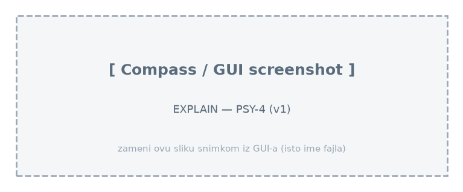
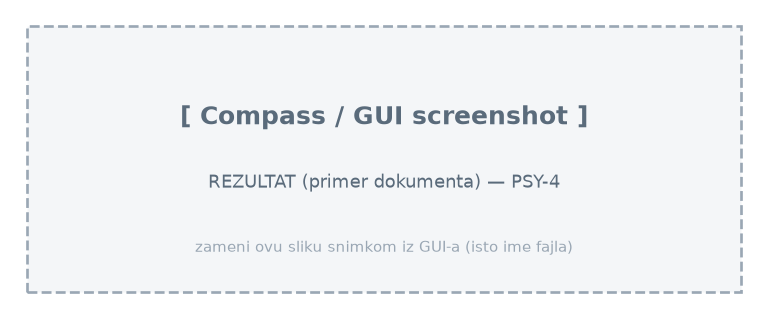

# Upit 4 - Grupisati studente prema izloženosti sajber nasilju; prikazati broj studenata, prosečan wellbeing indeks, depresivnost, anksioznost i stres, sortirano rastuće po wellbeing indeksu.

Kod upita:

~~~
db.wellbeing.aggregate([
  { $group: {
      _id: "$cyberbullying_exposure",
      broj_studenata: { $sum: 1 },
      prosek_wellbeing: { $avg: "$wellbeing_index" },
      prosek_depresija: { $avg: "$depression_score" },
      prosek_anksioznost: { $avg: "$anxiety_score" },
      prosek_stres: { $avg: "$stress_level" } } },
  { $sort: { prosek_wellbeing: 1 } }
], { allowDiskUse: true })
~~~

Brzina izvršavanja: 278 ms

Rezultat Explain opcije:

Primer izlaznog dokumenta:

