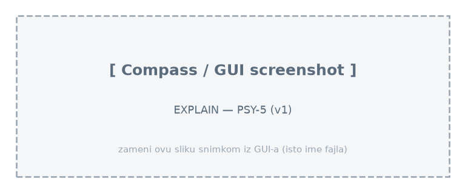

# Upit 5 - Broj studenata sa visokim skorom digitalne zavisnosti (>18.04) i niskim indeksom blagostanja (<50.06) koji NE koriste mreže intenzivno (≤4.20h); za tu grupu broj studenata, broj sa dominantnim kratkim videom i broj koji koriste mreže kasno noću.

Kod upita:

~~~
db.wellbeing.aggregate([
  { $match: { digital_addiction_score: { $gt: 18.04 }, wellbeing_index: { $lt: 50.06 } } },
  { $lookup: { from: "digital_behavior", localField: "_id", foreignField: "_id", as: "d" } },
  { $unwind: "$d" },
  { $match: { "d.social_media_hours": { $lte: 4.20 } } },
  { $addFields: {
      dominant: { $let: {
        vars: { m: { $max: ["$d.education_content_hours", "$d.short_video_hours",
                            "$d.entertainment_content_hours", "$d.news_content_hours"] } },
        in: { $switch: { branches: [
          { case: { $eq: ["$d.education_content_hours", "$$m"] }, then: "educational" },
          { case: { $eq: ["$d.short_video_hours", "$$m"] }, then: "short_video" },
          { case: { $eq: ["$d.entertainment_content_hours", "$$m"] }, then: "entertainment" }
        ], default: "informative" } } } },
      is_late: { $in: ["$d.late_night_usage", ["Often", "Always"]] } } },
  { $group: {
      _id: null,
      broj_studenata: { $sum: 1 },
      broj_kratki_video: { $sum: { $cond: [{ $eq: ["$dominant", "short_video"] }, 1, 0] } },
      broj_kasno_nocu: { $sum: { $cond: ["$is_late", 1, 0] } } } }
], { allowDiskUse: true })
~~~

Brzina izvršavanja: 1013 ms

Rezultat Explain opcije:

Primer izlaznog dokumenta:

