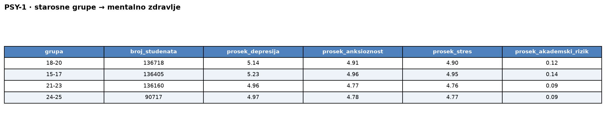
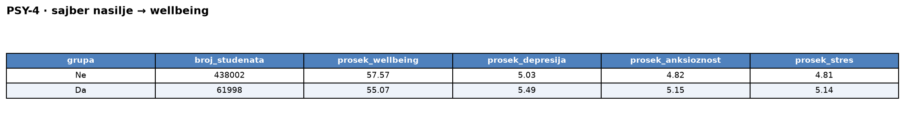
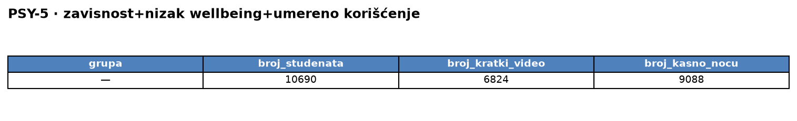

# Upiti — Studentski psiholog (v1, normalizovana šema)

> Pokrenuti u `mongosh` ili MongoDB Compass nad bazom `sbp-v1`.
> Vreme je izmereno preko `explain("executionStats")` (server vreme, medijana od 3 izvršavanja).

### 1. Grupisati studente po starosnim grupama (15-17, 18-20, 21-23, 24-25) i prikazati prosečnu depresivnost, anksioznost, stres i akademski rizik. — 10256 ms

```javascript
db.students.aggregate([
  { $lookup: { from: "wellbeing", localField: "_id", foreignField: "_id", as: "w" } },
  { $unwind: "$w" },
  { $lookup: { from: "academic", localField: "_id", foreignField: "_id", as: "a" } },
  { $unwind: "$a" },
  { $addFields: { age_group: { $switch: { branches: [
        { case: { $lte: ["$age", 17] }, then: "15-17" },
        { case: { $lte: ["$age", 20] }, then: "18-20" },
        { case: { $lte: ["$age", 23] }, then: "21-23" }
      ], default: "24-25" } } } },
  { $group: {
      _id: "$age_group",
      broj_studenata: { $sum: 1 },
      prosek_depresija: { $avg: "$w.depression_score" },
      prosek_anksioznost: { $avg: "$w.anxiety_score" },
      prosek_stres: { $avg: "$w.stress_level" },
      prosek_akademski_rizik: { $avg: "$a.academic_risk_score" } } },
  { $sort: { _id: 1 } }
], { allowDiskUse: true })
```

Rezultat upita:<br>


### 2. Grupisati studente prema dominantnom tipu digitalnog sadržaja; prikazati broj studenata i prosečan brain rot indeks, sortirano opadajuće po brain rot indeksu. — 379 ms

```javascript
db.digital_behavior.aggregate([
  { $addFields: { dominant_content_type: { $let: {
      vars: { m: { $max: ["$education_content_hours", "$short_video_hours",
                          "$entertainment_content_hours", "$news_content_hours"] } },
      in: { $switch: { branches: [
        { case: { $eq: ["$education_content_hours", "$$m"] }, then: "educational" },
        { case: { $eq: ["$short_video_hours", "$$m"] }, then: "short_video" },
        { case: { $eq: ["$entertainment_content_hours", "$$m"] }, then: "entertainment" }
      ], default: "informative" } } } } } },
  { $group: {
      _id: "$dominant_content_type",
      broj_studenata: { $sum: 1 },
      prosek_brain_rot: { $avg: "$brain_rot_index" } } },
  { $sort: { prosek_brain_rot: -1 } }
], { allowDiskUse: true })
```

Rezultat upita:<br>


### 3. Prikazati broj studenata koji koriste društvene mreže više od 6 sati dnevno, i za tu grupu prosečan broj sati sna, prosečan raspon pažnje i prosečan skor produktivnosti. — 388 ms

```javascript
db.digital_behavior.aggregate([
  { $match: { social_media_hours: { $gt: 6 } } },
  { $lookup: { from: "wellbeing", localField: "_id", foreignField: "_id", as: "w" } },
  { $unwind: "$w" },
  { $lookup: { from: "academic", localField: "_id", foreignField: "_id", as: "a" } },
  { $unwind: "$a" },
  { $group: {
      _id: null,
      broj_studenata: { $sum: 1 },
      prosek_san: { $avg: "$w.sleep_hours" },
      prosek_paznja: { $avg: "$a.attention_span_minutes" },
      prosek_produktivnost: { $avg: "$a.productivity_score" } } }
], { allowDiskUse: true })
```

Rezultat upita:<br>


### 4. Grupisati studente prema izloženosti sajber nasilju; prikazati broj studenata, prosečan wellbeing indeks, depresivnost, anksioznost i stres, sortirano rastuće po wellbeing indeksu. — 278 ms

```javascript
db.wellbeing.aggregate([
  { $group: {
      _id: "$cyberbullying_exposure",
      broj_studenata: { $sum: 1 },
      prosek_wellbeing: { $avg: "$wellbeing_index" },
      prosek_depresija: { $avg: "$depression_score" },
      prosek_anksioznost: { $avg: "$anxiety_score" },
      prosek_stres: { $avg: "$stress_level" } } },
  { $sort: { prosek_wellbeing: 1 } }
], { allowDiskUse: true })
```

Rezultat upita:<br>


### 5. Broj studenata sa visokim skorom digitalne zavisnosti (>18.04) i niskim indeksom blagostanja (<50.06) koji NE koriste mreže intenzivno (≤4.20h); za tu grupu broj studenata, broj sa dominantnim kratkim videom i broj koji koriste mreže kasno noću. — 1013 ms

```javascript
db.wellbeing.aggregate([
  { $match: { digital_addiction_score: { $gt: 18.04 }, wellbeing_index: { $lt: 50.06 } } },
  { $lookup: { from: "digital_behavior", localField: "_id", foreignField: "_id", as: "d" } },
  { $unwind: "$d" },
  { $match: { "d.social_media_hours": { $lte: 4.20 } } },
  { $addFields: {
      dominant: { $let: {
        vars: { m: { $max: ["$d.education_content_hours", "$d.short_video_hours",
                            "$d.entertainment_content_hours", "$d.news_content_hours"] } },
        in: { $switch: { branches: [
          { case: { $eq: ["$d.education_content_hours", "$$m"] }, then: "educational" },
          { case: { $eq: ["$d.short_video_hours", "$$m"] }, then: "short_video" },
          { case: { $eq: ["$d.entertainment_content_hours", "$$m"] }, then: "entertainment" }
        ], default: "informative" } } } },
      is_late: { $in: ["$d.late_night_usage", ["Often", "Always"]] } } },
  { $group: {
      _id: null,
      broj_studenata: { $sum: 1 },
      broj_kratki_video: { $sum: { $cond: [{ $eq: ["$dominant", "short_video"] }, 1, 0] } },
      broj_kasno_nocu: { $sum: { $cond: ["$is_late", 1, 0] } } } }
], { allowDiskUse: true })
```

Rezultat upita:<br>

