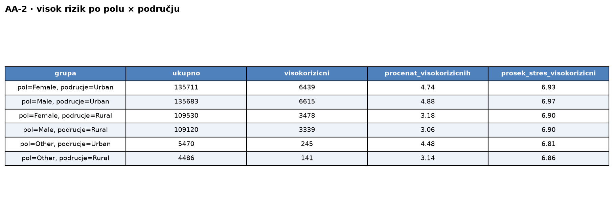
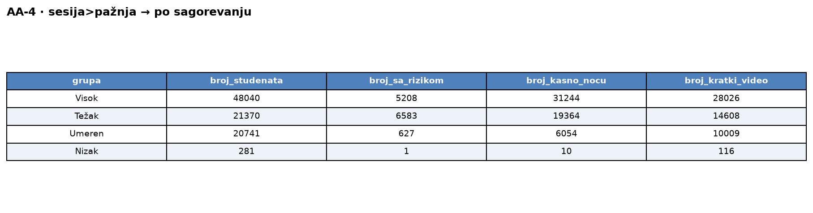
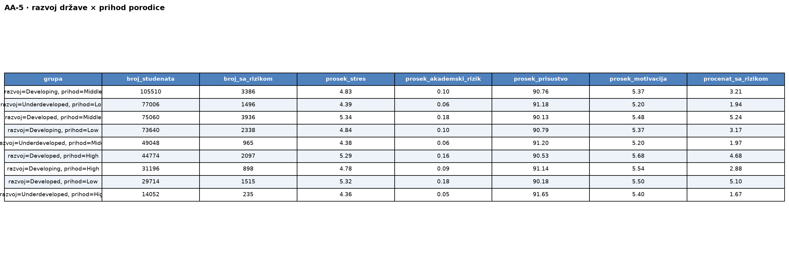

# Upiti — Akademski savetnik (v1, normalizovana šema)

> Pokrenuti u `mongosh` ili MongoDB Compass nad bazom `sbp-v1`.
> Vreme je izmereno preko `explain("executionStats")` (server vreme, medijana od 3 izvršavanja).

### 1. Grupisati studente po dnevnim satima korišćenja društvenih mreža (<2h, 2-4h, 4-6h, >6h); prikazati broj studenata, procenat, prosečan skor produktivnosti, prosečan broj sati učenja i prosečan akademski rizik. — 5015 ms

Ukupan broj studenata se izračuna zasebno i ubaci kao konstanta (za procenat).

```javascript
// ukupan broj studenata
const ukupno = db.digital_behavior.countDocuments();

db.digital_behavior.aggregate([
  { $lookup: { from: "academic", localField: "_id", foreignField: "_id", as: "a" } },
  { $unwind: "$a" },
  { $addFields: { band: { $switch: { branches: [
        { case: { $lt: ["$social_media_hours", 2] }, then: "<2h" },
        { case: { $lt: ["$social_media_hours", 4] }, then: "2-4h" },
        { case: { $lte: ["$social_media_hours", 6] }, then: "4-6h" }
      ], default: ">6h" } } } },
  { $group: {
      _id: "$band",
      broj_studenata: { $sum: 1 },
      prosek_produktivnost: { $avg: "$a.productivity_score" },
      prosek_sati_ucenja: { $avg: "$a.study_hours_per_week" },
      prosek_akademski_rizik: { $avg: "$a.academic_risk_score" } } },
  { $addFields: { procenat: { $multiply: [{ $divide: ["$broj_studenata", ukupno] }, 100] } } },
  { $sort: { _id: 1 } }
], { allowDiskUse: true })
```

Rezultat upita:<br>


### 2. Procenat „visokorizičnih" studenata (digital_addiction_score ≥ 25) po polu i tipu područja, i njihov prosečan nivo stresa. — 5365 ms

```javascript
db.wellbeing.aggregate([
  { $lookup: { from: "students", localField: "_id", foreignField: "_id", as: "s" } },
  { $unwind: "$s" },
  { $addFields: { high_risk: { $gte: ["$digital_addiction_score", 25] } } },
  { $group: {
      _id: { pol: "$s.gender", podrucje: "$s.urban_rural" },
      ukupno: { $sum: 1 },
      visokorizicni: { $sum: { $cond: ["$high_risk", 1, 0] } },
      suma_stres_hr: { $sum: { $cond: ["$high_risk", "$stress_level", 0] } } } },
  { $addFields: {
      procenat_visokorizicnih: { $multiply: [{ $divide: ["$visokorizicni", "$ukupno"] }, 100] },
      prosek_stres_visokorizicni: { $cond: [
        { $gt: ["$visokorizicni", 0] },
        { $divide: ["$suma_stres_hr", "$visokorizicni"] },
        null ] } } },
  { $project: { suma_stres_hr: 0 } },
  { $sort: { procenat_visokorizicnih: -1 } }
], { allowDiskUse: true })
```

Rezultat upita:<br>


### 3. Izdvojiti studente sa akademskim rizikom iznad proseka; prikazati ukupan broj studenata, prosečan broj sati učenja, prosečan skor produktivnosti i prosečan broj sati na društvenim mrežama. — 522 ms (prosek + filter)

Dva koraka: prvo se izračuna prosečan akademski rizik, pa se ta vrednost ubaci kao prag.

```javascript
// 1) prosečan akademski rizik
const prosek = db.academic.aggregate([
  { $group: { _id: null, m: { $avg: "$academic_risk_score" } } }
]).toArray()[0].m;

// 2) studenti iznad proseka
db.academic.aggregate([
  { $match: { academic_risk_score: { $gt: prosek } } },
  { $lookup: { from: "digital_behavior", localField: "_id", foreignField: "_id", as: "d" } },
  { $unwind: "$d" },
  { $group: {
      _id: null,
      broj_studenata: { $sum: 1 },
      prosek_sati_ucenja: { $avg: "$study_hours_per_week" },
      prosek_produktivnost: { $avg: "$productivity_score" },
      prosek_sati_mreze: { $avg: "$d.social_media_hours" } } }
], { allowDiskUse: true })
```

Rezultat upita:<br>


### 4. Studenti kod kojih je prosečno trajanje sesije duže od trajanja koncentracije, grupisani po nivou digitalnog sagorevanja (iz brain_rot_index); za svaku grupu broj studenata, broj sa akademskim rizikom ≠ 0, broj koji koriste mreže kasno noću i broj sa dominantnim kratkim videom. — 5534 ms

```javascript
db.digital_behavior.aggregate([
  { $lookup: { from: "academic", localField: "_id", foreignField: "_id", as: "a" } },
  { $unwind: "$a" },
  { $match: { $expr: { $gt: ["$average_session_length_minutes", "$a.attention_span_minutes"] } } },
  { $addFields: {
      burnout: { $switch: { branches: [
        { case: { $lt: ["$brain_rot_index", 12.57] }, then: "Nizak" },
        { case: { $lt: ["$brain_rot_index", 25.09] }, then: "Umeren" },
        { case: { $lt: ["$brain_rot_index", 34.77] }, then: "Visok" }
      ], default: "Težak" } },
      dominant: { $let: {
        vars: { m: { $max: ["$education_content_hours", "$short_video_hours",
                            "$entertainment_content_hours", "$news_content_hours"] } },
        in: { $switch: { branches: [
          { case: { $eq: ["$education_content_hours", "$$m"] }, then: "educational" },
          { case: { $eq: ["$short_video_hours", "$$m"] }, then: "short_video" },
          { case: { $eq: ["$entertainment_content_hours", "$$m"] }, then: "entertainment" }
        ], default: "informative" } } } },
      is_late: { $in: ["$late_night_usage", ["Often", "Always"]] } } },
  { $group: {
      _id: "$burnout",
      broj_studenata: { $sum: 1 },
      broj_sa_rizikom: { $sum: { $cond: [{ $ne: ["$a.academic_risk_score", 0] }, 1, 0] } },
      broj_kasno_nocu: { $sum: { $cond: ["$is_late", 1, 0] } },
      broj_kratki_video: { $sum: { $cond: [{ $eq: ["$dominant", "short_video"] }, 1, 0] } } } },
  { $sort: { _id: 1 } }
], { allowDiskUse: true })
```

Rezultat upita:<br>


### 5. Grupisati studente prema kombinaciji nivoa razvijenosti države i nivoa prihoda porodice; za svaku grupu broj studenata, procenat sa akademskim rizikom (>0), prosečan stres, prosečan akademski rizik, prosečno prisustvo nastavi i prosečnu akademsku motivaciju, sortirano opadajuće po procentu sa rizikom. — 15394 ms

```javascript
db.students.aggregate([
  { $lookup: { from: "countries", localField: "country", foreignField: "_id", as: "c" } },
  { $unwind: "$c" },
  { $lookup: { from: "academic", localField: "_id", foreignField: "_id", as: "a" } },
  { $unwind: "$a" },
  { $lookup: { from: "wellbeing", localField: "_id", foreignField: "_id", as: "w" } },
  { $unwind: "$w" },
  { $group: {
      _id: { razvoj: "$c.development_level", prihod: "$family_income_level" },
      broj_studenata: { $sum: 1 },
      broj_sa_rizikom: { $sum: { $cond: [{ $gt: ["$a.academic_risk_score", 0] }, 1, 0] } },
      prosek_stres: { $avg: "$w.stress_level" },
      prosek_akademski_rizik: { $avg: "$a.academic_risk_score" },
      prosek_prisustvo: { $avg: "$a.class_attendance_rate" },
      prosek_motivacija: { $avg: "$a.academic_motivation" } } },
  { $addFields: { procenat_sa_rizikom: {
      $multiply: [{ $divide: ["$broj_sa_rizikom", "$broj_studenata"] }, 100] } } },
  { $sort: { procenat_sa_rizikom: -1 } }
], { allowDiskUse: true })
```

Rezultat upita:<br>

