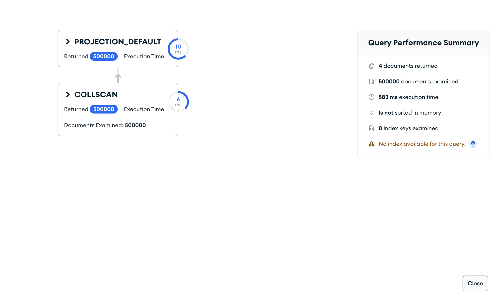

# Upit 1 (optimizovan) - Grupisati studente po dnevnim satima korišćenja društvenih mreža (<2h, 2-4h, 4-6h, >6h); prikazati broj studenata, procenat, prosečan skor produktivnosti, prosečan broj sati učenja i prosečan akademski rizik.

Kod upita:

~~~
// ukupan broj studenata
const ukupno = db.students.countDocuments();

db.students.aggregate([
  { $group: {
      _id: "$derived.social_media_band",
      broj_studenata: { $sum: 1 },
      prosek_produktivnost: { $avg: "$productivity_score" },
      prosek_sati_ucenja: { $avg: "$study_hours_per_week" },
      prosek_akademski_rizik: { $avg: "$academic_risk_score" } } },
  { $addFields: { procenat: { $multiply: [{ $divide: ["$broj_studenata", ukupno] }, 100] } } },
  { $sort: { _id: 1 } }
], { allowDiskUse: true })
~~~

Brzina izvršavanja: 565 ms

Rezultat Explain opcije:

Primer izlaznog dokumenta:

Zaključak:
  • Uklonjen `$lookup` (academic) i grupisanje po `derived.social_media_band` → ~9× brže (5015→565 ms). Grupisanje po celoj kolekciji (COLLSCAN), bez spajanja.
