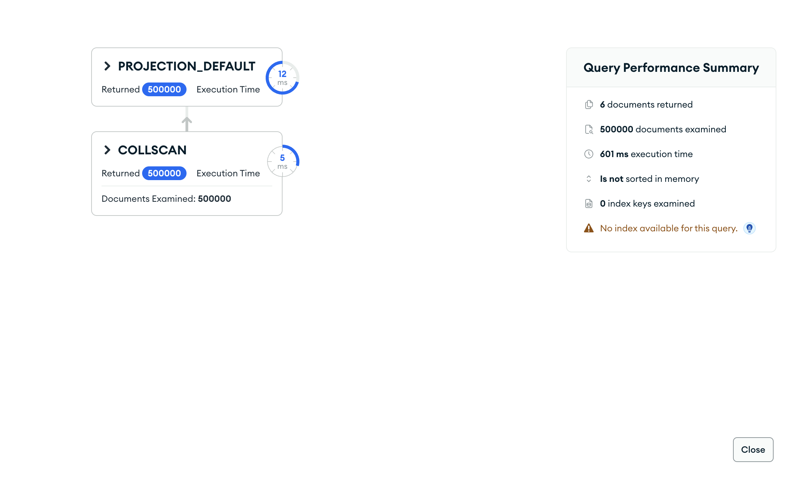

# Upit 2 (optimizovan) - Procenat „visokorizičnih“ studenata (digital_addiction_score ≥ 25) po polu i tipu područja, i njihov prosečan nivo stresa.

Kod upita:

~~~
db.students.aggregate([
  { $group: {
      _id: { pol: "$gender", podrucje: "$urban_rural" },
      ukupno: { $sum: 1 },
      visokorizicni: { $sum: { $cond: ["$derived.addiction_high_risk", 1, 0] } },
      suma_stres_hr: { $sum: { $cond: ["$derived.addiction_high_risk", "$stress_level", 0] } } } },
  { $addFields: {
      procenat_visokorizicnih: { $multiply: [{ $divide: ["$visokorizicni", "$ukupno"] }, 100] },
      prosek_stres_visokorizicni: { $cond: [
        { $gt: ["$visokorizicni", 0] },
        { $divide: ["$suma_stres_hr", "$visokorizicni"] },
        null ] } } },
  { $project: { suma_stres_hr: 0 } },
  { $sort: { procenat_visokorizicnih: -1 } }
], { allowDiskUse: true })
~~~

Brzina izvršavanja: 529 ms

Rezultat Explain opcije:

Primer izlaznog dokumenta:

Zaključak:
  • Uklonjen `$lookup` (students) i korišćen prekomputovani `derived.addiction_high_risk` → ~10× brže (5365→529 ms). Grupisanje po celoj kolekciji (COLLSCAN).
