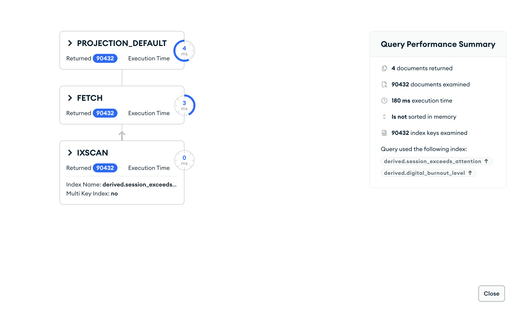

# Upit 4 (optimizovan) - Studenti kod kojih je prosečno trajanje sesije duže od trajanja koncentracije, grupisani po nivou digitalnog sagorevanja (iz brain_rot_index); za svaku grupu broj studenata, broj sa akademskim rizikom ≠ 0, broj koji koriste mreže kasno noću i broj sa dominantnim kratkim videom.

Kod upita:

~~~
db.students.aggregate([
  { $match: { "derived.session_exceeds_attention": true } },
  { $group: {
      _id: "$derived.digital_burnout_level",
      broj_studenata: { $sum: 1 },
      broj_sa_rizikom: { $sum: { $cond: ["$derived.has_academic_risk", 1, 0] } },
      broj_kasno_nocu: { $sum: { $cond: ["$derived.is_late_night", 1, 0] } },
      broj_kratki_video: { $sum: { $cond: ["$derived.is_short_video_dominant", 1, 0] } } } },
  { $sort: { _id: 1 } }
], { allowDiskUse: true })
~~~

Brzina izvršavanja: 153 ms

Rezultat Explain opcije:

Primer izlaznog dokumenta:

Zaključak:
  • Najveće ubrzanje (~36×): u v1 je `$expr` poređenje polja (sesija vs pažnja) posle join-a forsiralo pun pregled; u v2 je to prekomputovano (`derived.session_exceeds_attention`) i indeksirano → `IXSCAN` (5534→153 ms).
