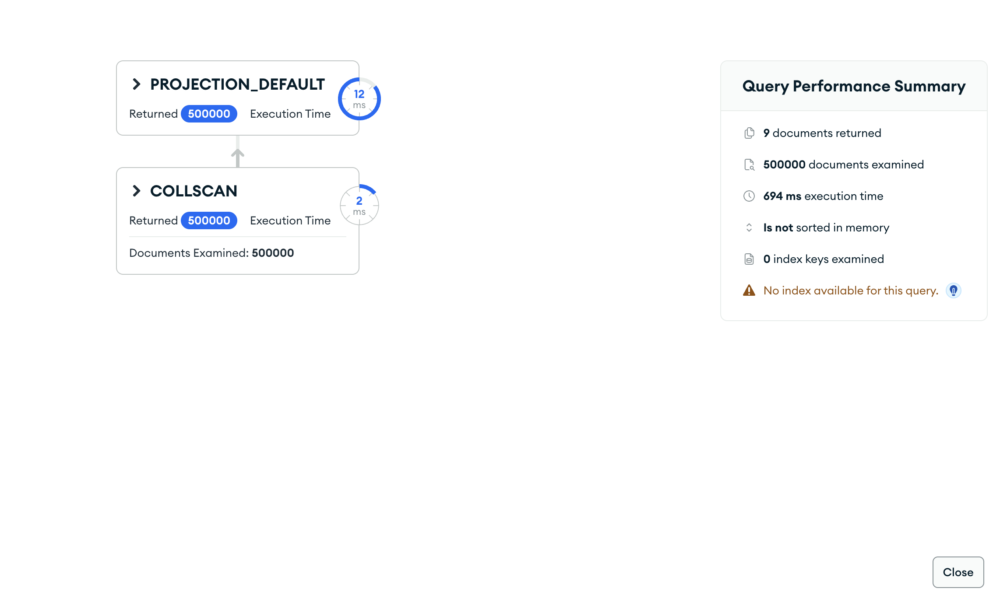

# Upit 5 (optimizovan) - Grupisati studente prema kombinaciji nivoa razvijenosti države i nivoa prihoda porodice; za svaku grupu broj studenata, procenat sa akademskim rizikom (>0), prosečan stres, prosečan akademski rizik, prosečno prisustvo nastavi i prosečnu akademsku motivaciju, sortirano opadajuće po procentu sa rizikom.

Kod upita:

~~~
db.students.aggregate([
  { $group: {
      _id: { razvoj: "$development_level", prihod: "$family_income_level" },
      broj_studenata: { $sum: 1 },
      broj_sa_rizikom: { $sum: { $cond: ["$derived.has_academic_risk", 1, 0] } },
      prosek_stres: { $avg: "$stress_level" },
      prosek_akademski_rizik: { $avg: "$academic_risk_score" },
      prosek_prisustvo: { $avg: "$class_attendance_rate" },
      prosek_motivacija: { $avg: "$academic_motivation" } } },
  { $addFields: { procenat_sa_rizikom: {
      $multiply: [{ $divide: ["$broj_sa_rizikom", "$broj_studenata"] }, 100] } } },
  { $sort: { procenat_sa_rizikom: -1 } }
], { allowDiskUse: true })
~~~

Brzina izvršavanja: 669 ms

Rezultat Explain opcije:

Primer izlaznog dokumenta:

Zaključak:
  • Uklonjena tri `$lookup` join-a (countries, academic, wellbeing) i `development_level` denormalizovan (Extended Reference) → ~23× brže (15394→669 ms). Grupisanje po celoj kolekciji (COLLSCAN), bez spajanja.
