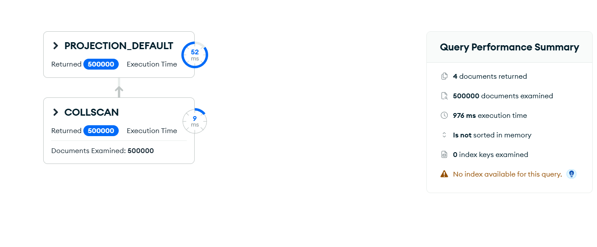
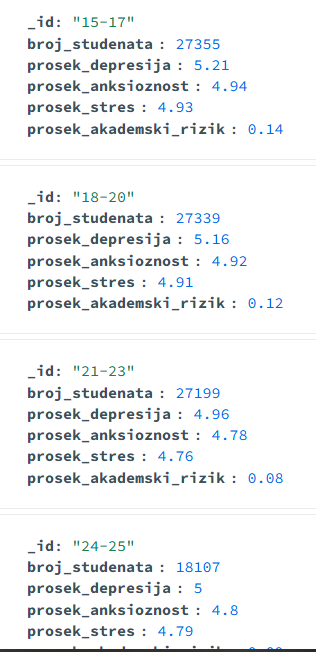

# Upit 1 (optimizovan) - Grupisati studente po starosnim grupama (15-17, 18-20, 21-23, 24-25) i prikazati prosečnu depresivnost, anksioznost, stres i akademski rizik.

Kod upita:

```
db.students.aggregate([
  { $group: {
      _id: "$derived.age_group",
      broj_studenata: { $sum: 1 },
      prosek_depresija: { $avg: "$depression_score" },
      prosek_anksioznost: { $avg: "$anxiety_score" },
      prosek_stres: { $avg: "$stress_level" },
      prosek_akademski_rizik: { $avg: "$academic_risk_score" } } },
  { $project: {
      _id: 1,
      broj_studenata: 1,
      prosek_depresija: { $round: ["$prosek_depresija", 2] },
      prosek_anksioznost: { $round: ["$prosek_anksioznost", 2] },
      prosek_stres: { $round: ["$prosek_stres", 2] },
      prosek_akademski_rizik: { $round: ["$prosek_akademski_rizik", 2] } } },
  { $sort: { _id: 1 } }
], { allowDiskUse: true })
```

Brzina izvršavanja: 502 ms

Rezultat Explain opcije:



Primer izlaznog dokumenta:



Zaključak:
• Uklonjena su dva `$lookup` join-a (wellbeing, academic), a grupiše se po prekomputovanom `derived.age_group`. Vreme padá ~20× (10256→502 ms). Grupisanje ide po celoj kolekciji (COLLSCAN), ali bez skupih spajanja.
