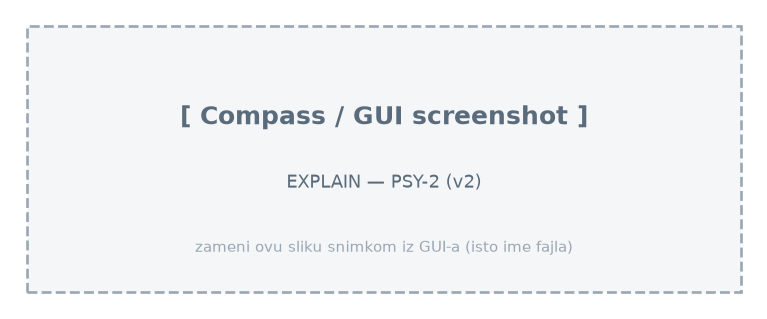
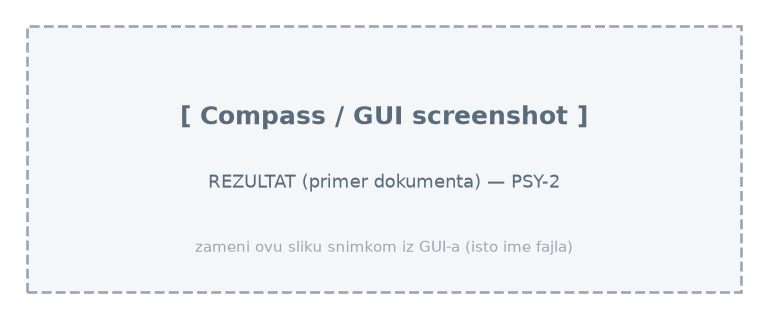

# Upit 2 (optimizovan) - Grupisati studente prema dominantnom tipu digitalnog sadržaja; prikazati broj studenata i prosečan brain rot indeks, sortirano opadajuće po brain rot indeksu.

Kod upita:

~~~
db.students.aggregate([
  { $group: {
      _id: "$derived.dominant_content_type",
      broj_studenata: { $sum: 1 },
      prosek_brain_rot: { $avg: "$brain_rot_index" } } },
  { $sort: { prosek_brain_rot: -1 } }
], { allowDiskUse: true })
~~~

Brzina izvršavanja: 442 ms

Rezultat Explain opcije:

Primer izlaznog dokumenta:

Zaključak:
  • Upit i u v1 radi nad jednom kolekcijom (bez join-a), pa denormalizacija ne donosi ubrzanje — v2 je čak neznatno sporiji zbog većih dokumenata. Pošten nalaz: optimizacija ne pomaže kada nema uskog grla.
