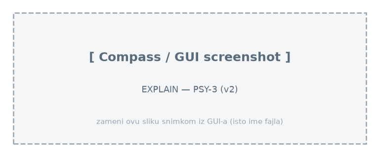

# Upit 3 (optimizovan) - Prikazati broj studenata koji koriste društvene mreže više od 6 sati dnevno, i za tu grupu prosečan broj sati sna, prosečan raspon pažnje i prosečan skor produktivnosti.

Kod upita:

~~~
db.students.aggregate([
  { $match: { "derived.social_gt6": true } },
  { $group: {
      _id: null,
      broj_studenata: { $sum: 1 },
      prosek_san: { $avg: "$sleep_hours" },
      prosek_paznja: { $avg: "$attention_span_minutes" },
      prosek_produktivnost: { $avg: "$productivity_score" } } }
], { allowDiskUse: true })
~~~

Brzina izvršavanja: 17 ms

Rezultat Explain opcije:

Primer izlaznog dokumenta:

Zaključak:
  • Selektivan `$match` (`derived.social_gt6`) koristi indeks → `IXSCAN` umesto punog pregleda, uz uklonjena 2 join-a. Vreme padá ~23× (388→17 ms).
