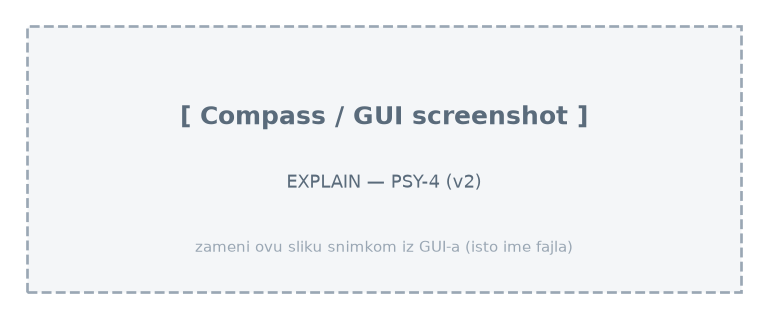
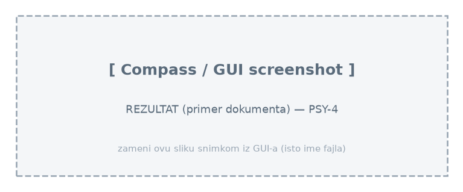

# Upit 4 (optimizovan) - Grupisati studente prema nivou izloženosti sajber nasilju i nivou brain rot-a. Za svaku grupu prikazati broj studenata, prosečan wellbeing indeks, prosečnu depresivnost, prosečnu anksioznost i prosečan nivo stresa. Rezultate sortirati prema najnižem prosečnom wellbeing indeksu.

Kod upita:

```
db.students.aggregate([
  { $match: { brain_rot_level: { $ne: null } } },
  { $group: {
      _id: {
        cyberbullying_exposure: "$cyberbullying_exposure",
        brain_rot_level: "$brain_rot_level"
      },
      broj_studenata: { $sum: 1 },
      prosek_wellbeing: { $avg: "$wellbeing_index" },
      prosek_depresija: { $avg: "$depression_score" },
      prosek_anksioznost: { $avg: "$anxiety_score" },
      prosek_stres: { $avg: "$stress_level" } } },
  { $project: {
      _id: 0,
      cyberbullying_exposure: "$_id.cyberbullying_exposure",
      brain_rot_level: "$_id.brain_rot_level",
      broj_studenata: 1,
      prosek_wellbeing: { $round: ["$prosek_wellbeing", 2] },
      prosek_depresija: { $round: ["$prosek_depresija", 2] },
      prosek_anksioznost: { $round: ["$prosek_anksioznost", 2] },
      prosek_stres: { $round: ["$prosek_stres", 2] } } },
  { $sort: { prosek_wellbeing: 1 } }
], { allowDiskUse: true })
```

Brzina izvršavanja: 410 ms

Rezultat Explain opcije:



Primer izlaznog dokumenta:



Zaključak:
• Jedna kolekcija i u v1; nema join-a ni selektivnog filtera, pa je COLLSCAN neizbežan u obe verzije — slično vreme (pošten nalaz).
