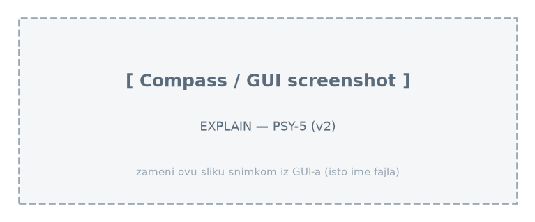
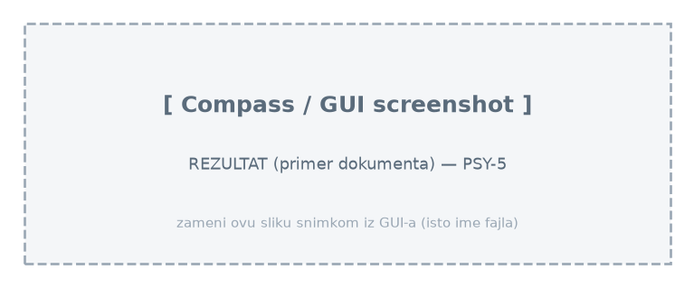

# Upit 5 (optimizovan) - Broj studenata sa visokim skorom digitalne zavisnosti (>18.04) i niskim indeksom blagostanja (<50.06) koji NE koriste mreže intenzivno (≤4.20h); za tu grupu broj studenata, broj sa dominantnim kratkim videom i broj koji koriste mreže kasno noću.

Kod upita:

~~~
db.students.aggregate([
  { $match: { digital_addiction_score: { $gt: 18.04 },
              wellbeing_index: { $lt: 50.06 },
              social_media_hours: { $lte: 4.20 } } },
  { $group: {
      _id: null,
      broj_studenata: { $sum: 1 },
      broj_kratki_video: { $sum: { $cond: ["$derived.is_short_video_dominant", 1, 0] } },
      broj_kasno_nocu: { $sum: { $cond: ["$derived.is_late_night", 1, 0] } } } }
], { allowDiskUse: true })
~~~

Brzina izvršavanja: 81 ms

Rezultat Explain opcije:

Primer izlaznog dokumenta:

Zaključak:
  • Složeni indeks `{digital_addiction_score, wellbeing_index, social_media_hours}` + uklonjen join → `IXSCAN`, ~12× brže (1013→81 ms).
