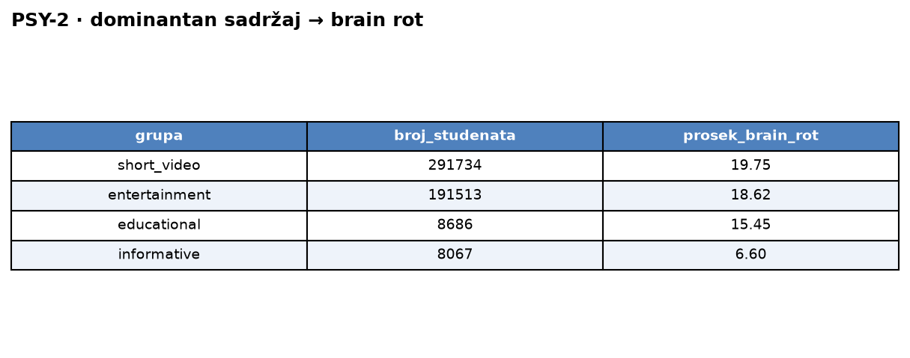
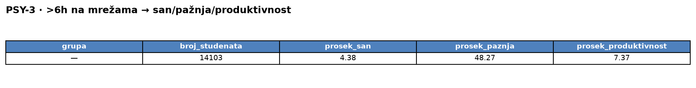

# Upiti — Studentski psiholog (v2, denormalizovana šema)

> Pokrenuti u `mongosh` ili MongoDB Compass nad bazom `sbp-v2` (jedna kolekcija `students`).
> Vreme je izmereno preko `explain("executionStats")` (server vreme, medijana od 3 izvršavanja).

### 1. Po starosnim grupama (15-17, 18-20, 21-23, 24-25): prosečna depresivnost, anksioznost, stres i akademski rizik. — 502 ms

```javascript
db.students.aggregate([
  { $group: {
      _id: "$derived.age_group",
      broj_studenata: { $sum: 1 },
      prosek_depresija: { $avg: "$depression_score" },
      prosek_anksioznost: { $avg: "$anxiety_score" },
      prosek_stres: { $avg: "$stress_level" },
      prosek_akademski_rizik: { $avg: "$academic_risk_score" } } },
  { $sort: { _id: 1 } }
], { allowDiskUse: true })
```

Rezultat upita:<br>


### 2. Po dominantnom tipu sadržaja: broj studenata i prosečan brain rot indeks, sortirano opadajuće. — 442 ms

```javascript
db.students.aggregate([
  { $group: {
      _id: "$derived.dominant_content_type",
      broj_studenata: { $sum: 1 },
      prosek_brain_rot: { $avg: "$brain_rot_index" } } },
  { $sort: { prosek_brain_rot: -1 } }
], { allowDiskUse: true })
```

Rezultat upita:<br>


### 3. Studenti sa >6h na mrežama dnevno: broj, prosečan san, raspon pažnje i skor produktivnosti. — 17 ms

```javascript
db.students.aggregate([
  { $match: { "derived.social_gt6": true } },
  { $group: {
      _id: null,
      broj_studenata: { $sum: 1 },
      prosek_san: { $avg: "$sleep_hours" },
      prosek_paznja: { $avg: "$attention_span_minutes" },
      prosek_produktivnost: { $avg: "$productivity_score" } } }
], { allowDiskUse: true })
```

Rezultat upita:<br>


### 4. Po izloženosti sajber nasilju: broj, prosečan wellbeing, depresivnost, anksioznost i stres, sortirano rastuće po wellbeing-u. — 410 ms

```javascript
db.students.aggregate([
  { $group: {
      _id: "$cyberbullying_exposure",
      broj_studenata: { $sum: 1 },
      prosek_wellbeing: { $avg: "$wellbeing_index" },
      prosek_depresija: { $avg: "$depression_score" },
      prosek_anksioznost: { $avg: "$anxiety_score" },
      prosek_stres: { $avg: "$stress_level" } } },
  { $sort: { prosek_wellbeing: 1 } }
], { allowDiskUse: true })
```

Rezultat upita:<br>


### 5. Visok skor zavisnosti (>18.04) i nizak indeks blagostanja (<50.06) uz umereno korišćenje mreža (≤4.20h): broj, broj sa dominantnim kratkim videom, broj koji koriste mreže kasno noću. — 81 ms

```javascript
db.students.aggregate([
  { $match: { digital_addiction_score: { $gt: 18.04 },
              wellbeing_index: { $lt: 50.06 },
              social_media_hours: { $lte: 4.20 } } },
  { $group: {
      _id: null,
      broj_studenata: { $sum: 1 },
      broj_kratki_video: { $sum: { $cond: ["$derived.is_short_video_dominant", 1, 0] } },
      broj_kasno_nocu: { $sum: { $cond: ["$derived.is_late_night", 1, 0] } } } }
], { allowDiskUse: true })
```

Rezultat upita:<br>

