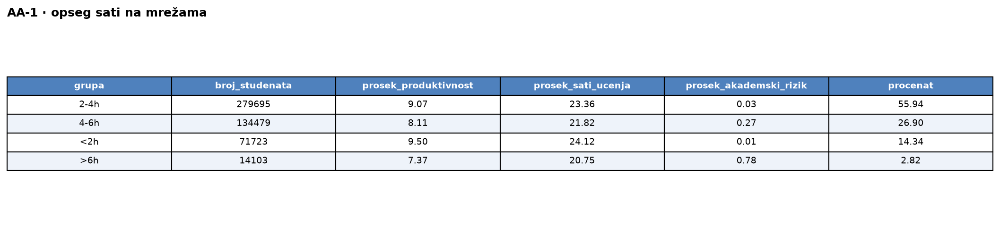
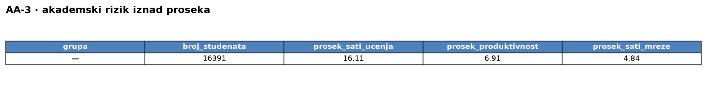

# Upiti — Akademski savetnik (v2, denormalizovana šema)

> Pokrenuti u `mongosh` ili MongoDB Compass nad bazom `sbp-v2` (jedna kolekcija `students`).
> Vreme je izmereno preko `explain("executionStats")` (server vreme, medijana od 3 izvršavanja).

### 1. Po dnevnim satima na mrežama (<2h, 2-4h, 4-6h, >6h): broj, procenat, prosečan skor produktivnosti, prosečan broj sati učenja, prosečan akademski rizik. — 565 ms

```javascript
db.students.aggregate([
  { $group: {
      _id: "$derived.social_media_band",
      broj_studenata: { $sum: 1 },
      prosek_produktivnost: { $avg: "$productivity_score" },
      prosek_sati_ucenja: { $avg: "$study_hours_per_week" },
      prosek_akademski_rizik: { $avg: "$academic_risk_score" } } },
  // procenat od ukupnog: skupi grupe u niz + saberi ukupno, pa razmotaj nazad
  { $group: { _id: null, grupe: { $push: "$$ROOT" }, ukupno: { $sum: "$broj_studenata" } } },
  { $unwind: "$grupe" },
  { $addFields: { "grupe.procenat": { $multiply: [{ $divide: ["$grupe.broj_studenata", "$ukupno"] }, 100] } } },
  { $replaceRoot: { newRoot: "$grupe" } },
  { $sort: { _id: 1 } }
], { allowDiskUse: true })
```

Rezultat upita:<br>


### 2. Procenat visokorizičnih (digital_addiction_score ≥ 25) po polu i tipu područja, i njihov prosečan nivo stresa. — 529 ms

```javascript
db.students.aggregate([
  { $group: {
      _id: { pol: "$gender", podrucje: "$urban_rural" },
      ukupno: { $sum: 1 },
      visokorizicni: { $sum: { $cond: ["$derived.addiction_high_risk", 1, 0] } },
      suma_stres_hr: { $sum: { $cond: ["$derived.addiction_high_risk", "$stress_level", 0] } } } },
  { $addFields: {
      procenat_visokorizicnih: { $multiply: [{ $divide: ["$visokorizicni", "$ukupno"] }, 100] },
      prosek_stres_visokorizicni: { $cond: [
        { $gt: ["$visokorizicni", 0] },
        { $divide: ["$suma_stres_hr", "$visokorizicni"] },
        null ] } } },
  { $project: { suma_stres_hr: 0 } },
  { $sort: { procenat_visokorizicnih: -1 } }
], { allowDiskUse: true })
```

Rezultat upita:<br>


### 3. Studenti sa akademskim rizikom iznad proseka: ukupan broj, prosečan broj sati učenja, skor produktivnosti i broj sati na mrežama. — 376 ms (prosek + filter)

Dva koraka: prvo prosečan akademski rizik, pa filter iznad tog praga (u v2 `$match` koristi indeks `academic_risk_score`).

```javascript
// 1) prosečan akademski rizik
const prosek = db.students.aggregate([
  { $group: { _id: null, m: { $avg: "$academic_risk_score" } } }
]).toArray()[0].m;

// 2) studenti iznad proseka
db.students.aggregate([
  { $match: { academic_risk_score: { $gt: prosek } } },
  { $group: {
      _id: null,
      broj_studenata: { $sum: 1 },
      prosek_sati_ucenja: { $avg: "$study_hours_per_week" },
      prosek_produktivnost: { $avg: "$productivity_score" },
      prosek_sati_mreze: { $avg: "$social_media_hours" } } }
], { allowDiskUse: true })
```

Rezultat upita:<br>


### 4. Studenti kod kojih je trajanje sesije duže od trajanja koncentracije, grupisani po nivou digitalnog sagorevanja: broj, broj sa akademskim rizikom ≠ 0, broj koji koriste mreže kasno noću, broj sa dominantnim kratkim videom. — 153 ms

```javascript
db.students.aggregate([
  { $match: { "derived.session_exceeds_attention": true } },
  { $group: {
      _id: "$derived.digital_burnout_level",
      broj_studenata: { $sum: 1 },
      broj_sa_rizikom: { $sum: { $cond: ["$derived.has_academic_risk", 1, 0] } },
      broj_kasno_nocu: { $sum: { $cond: ["$derived.is_late_night", 1, 0] } },
      broj_kratki_video: { $sum: { $cond: ["$derived.is_short_video_dominant", 1, 0] } } } },
  { $sort: { _id: 1 } }
], { allowDiskUse: true })
```

Rezultat upita:<br>


### 5. Po kombinaciji nivoa razvijenosti države i nivoa prihoda porodice: broj, procenat sa akademskim rizikom (>0), prosečan stres, prosečan akademski rizik, prosečno prisustvo nastavi, prosečna akademska motivacija, sortirano opadajuće po procentu sa rizikom. — 669 ms

```javascript
db.students.aggregate([
  { $group: {
      _id: { razvoj: "$development_level", prihod: "$family_income_level" },
      broj_studenata: { $sum: 1 },
      broj_sa_rizikom: { $sum: { $cond: ["$derived.has_academic_risk", 1, 0] } },
      prosek_stres: { $avg: "$stress_level" },
      prosek_akademski_rizik: { $avg: "$academic_risk_score" },
      prosek_prisustvo: { $avg: "$class_attendance_rate" },
      prosek_motivacija: { $avg: "$academic_motivation" } } },
  { $addFields: { procenat_sa_rizikom: {
      $multiply: [{ $divide: ["$broj_sa_rizikom", "$broj_studenata"] }, 100] } } },
  { $sort: { procenat_sa_rizikom: -1 } }
], { allowDiskUse: true })
```

Rezultat upita:<br>

